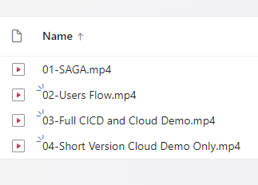
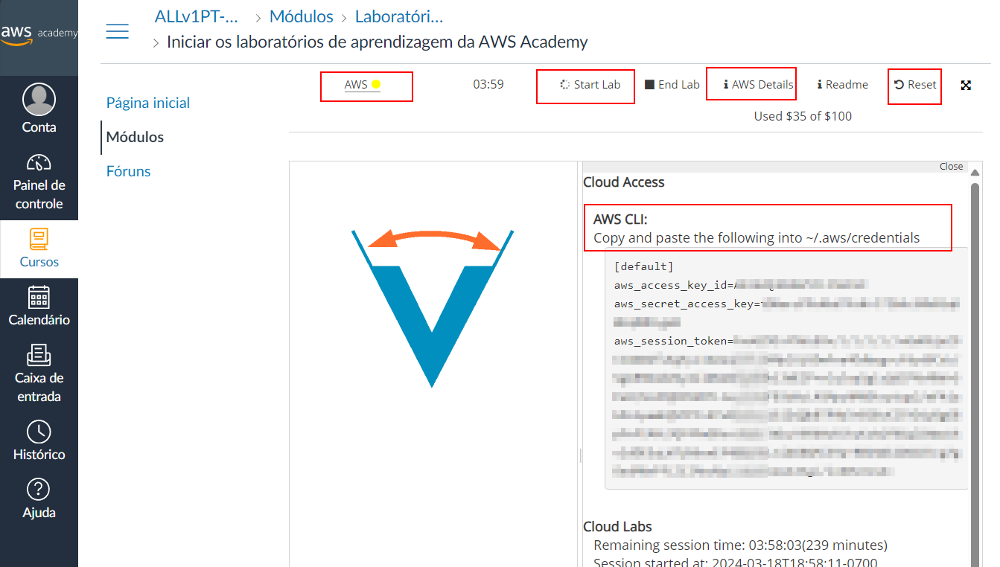
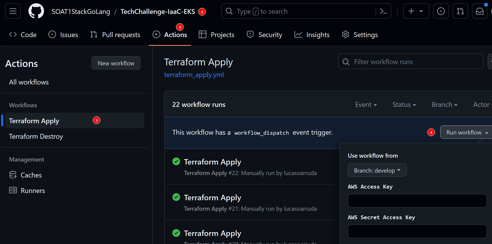
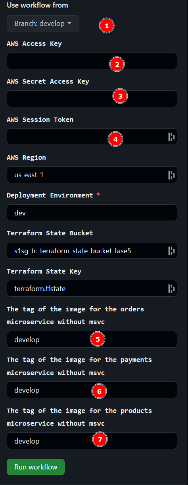
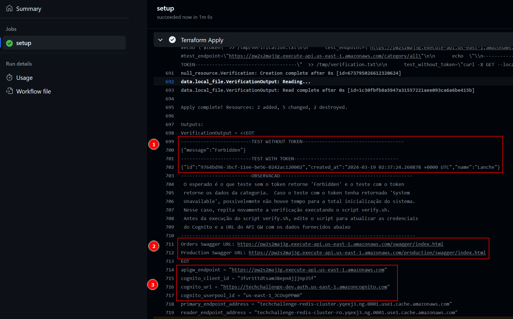

# Microservices Project

## Delivery Fase 5

Turma 1SOAT - Tech Challenge

Members:

- George Baronheid
- Lucas Arruda
- Murillo de Morais
- Ana Lúcia de Faria

## Table of Contents

1. [Links](#links)
2. [Videos](#videos)
3. [SAGA Pattern](#saga-pattern)
4. [OWASP ZAP Reports](#owasp-zap-reports)
5. [RIPD System Report](#ripd-system-report)
6. [For development and testing locally](#for-development-and-testing-locally)
7. [Cloud](#cloud)
    - [Diagram](#diagram)
    - [How to Run (Using AWSAcademy Account)](#how-to-run-using-awsacademy-account)

## Links

Main repo: <https://github.com/SOAT1StackGoLang/tech-challenge>

Microservice orders: <https://github.com/SOAT1StackGoLang/msvc-orders>

Microservice payments: <https://github.com/SOAT1StackGoLang/msvc-payments>

Microservice production: <https://github.com/SOAT1StackGoLang/msvc-production>

Infra Terraform: <https://github.com/SOAT1StackGoLang/TechChallenge-IaaC-EKS>

Lambda Authorizer: <https://github.com/SOAT1StackGoLang/oAuth2Authorizer>

## Videos

1. [Saga Video (15 min)](https://1drv.ms/f/s!AgAxf_qsrSnhhoBoyTNXHV5IvPHfdA?e=vSxalm)

2. [User Flow Video (03 min)](https://1drv.ms/f/s!AgAxf_qsrSnhhoBoyTNXHV5IvPHfdA?e=vSxalm)

Cloud Videos

3. [CI/CD and Cloud/App Demo (40 min)](https://1drv.ms/f/s!AgAxf_qsrSnhhoBoyTNXHV5IvPHfdA?e=vSxalm)

4. [Short Version Cloud/App Demo only (15 min)](https://1drv.ms/f/s!AgAxf_qsrSnhhoBoyTNXHV5IvPHfdA?e=vSxalm)



## SAGA Pattern

Explanation of the chosen SAGA pattern and its justification.

[SAGA Explanation](https://github.com/SOAT1StackGoLang/msvc-orders/blob/main/SAGA.md)

[Saga Video](https://1drv.ms/f/s!AgAxf_qsrSnhhoBoyTNXHV5IvPHfdA?e=vSxalm)

Checkout Flow Diagram:

[Excalidraw-1](./docs/checkout-1.excalidraw)

[Excalidraw-2](./docs/checkout-2.excalidraw)

Production Flow Diagram.

[Excalidraw](./docs/production-1.excalidraw)

## OWASP ZAP Reports

Zap reports are located in orders microservice, with the explanations [Zap Reports](https://github.com/SOAT1StackGoLang/msvc-orders/blob/main/owasp/README.md)

Save the report html files and open in the browser for a better experience.

## RIPD System Report

The report is located in the docs folder, [RIPD System Report](./docs/RIPD-TechChallenge-Fase5.pdf)

## For development and testing locally

Check the [Microservices Readme](./README.md)

## Cloud

### Diagram


### How to Run (Using AWSAcademy Account)

First clone the repository TechChallenge-IaaC-EKS and follow the instructions to create the EKS cluster.

```bash
git clone https://github.com/SOAT1StackGoLang/TechChallenge-IaaC-EKS.git
cd TechChallenge-IaaC-EKS
```

Login to your AWSAcademy account and start the lab, wait for the AWS Details Credentials to be available.
Rember this access will expire in 4 hours, so you will have to repeat the process to get the credentials again.



```bash
# Configure the AWS CLI file location ~/.aws/credentials
[default]
region=us-east-1
aws_access_key_id=****
aws_secret_access_key=**********
aws_session_token=************
```

Follow the steps to setup the credentials in your local machine, its also good to put the aws region in the config file.

Run the ./aws-setup.sh script to create the bucket that will store the terraform state.

```bash
./aws-setup.sh
# if you already have permission to the github repository, you will update the github secret values otherwise you will have to input it manually
```

Now lets create the infrastructure using github actions.



1. Go to the repository TechChallenge-IaaC-EKS
2. Click on the Actions tab
3. Click on the workflow "Terraform Apply"
4. Click on the "Run workflow" button



1. Choose the branch to run the workflow
2. Put the values for Access Key (if not already set by the aws-setup.sh script)
3. Put the values for Secret Key (if not already set by the aws-setup.sh script)
4. Put the values for Session Token (if not already set by the aws-setup.sh script)
5. The image tag for the msvc-orders (branch name, commit hash or tag)
6. The image tag for the msvc-payments (branch name, commit hash or tag)
7. The image tag for the msvc-production (branch name, commit hash or tag)

It will take some time to create the infrastructure, after that you can check the EKS cluster and the services running, if you see some Server Unaviaible, wait a little bit more, the services are starting, and run again the workflow to validate, somethimes the services are not ready when the validation is running by AWSAcademy.



1. Success Message
2. Swagger URLs
3. API Gateway and Cognitive URLs to be used on the verify.sh script

To get the a fresh token from the cognito, you can run the verify.sh script, it will show the values to be used in the Swagger Authorization.

```bash verify.sh
# verify.sh
######################## IMPORTANTE ########################################################
#  Antes de executar esse script, atualize os dados abaixo com as informações fornecidas pelo
#  terraform apply
############################################################################################
apigw_endpoint="https://ocx5ca8dca.execute-api.us-east-1.amazonaws.com"
cognito_client_id="3bll7tmkn8ascb7c3n7nnmleek"
cognito_url="https://techchallenge-dev.auth.us-east-1.amazoncognito.com"
cognito_userpool_id="us-east-1_jSj8VLYaM"
```

For more information, see readme from the Infra EKS Terraform

[Infra EKS Terraform](https://github.com/SOAT1StackGoLang/TechChallenge-IaaC-EKS)

The End!

## License

[MIT](../LICENSE)
